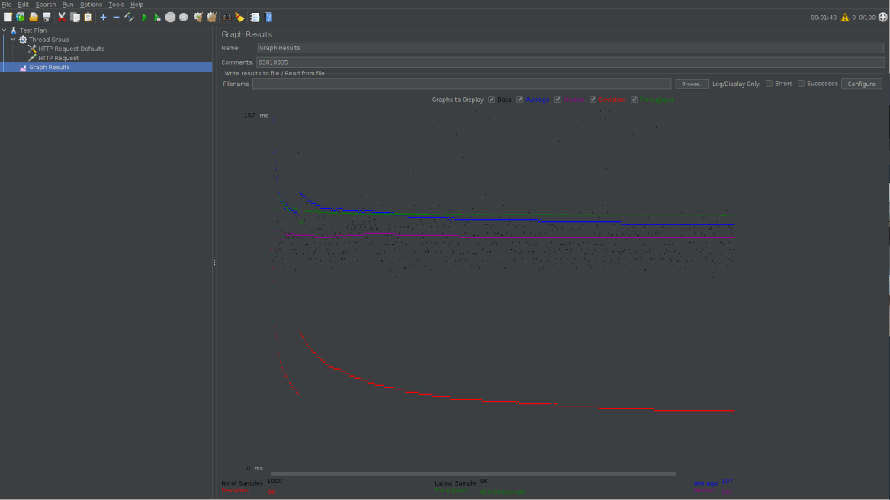

## Quality Attribute II
RECAP : **Quality Attribute Scenario**
**Source of Stimulus** -> [**Stimulus**] -> **Environment** -> [**Response**] -> **Response Measure**

### Modifiability
- Modifiability refers to its **receptiveness to change**
- **Change happens**
  - add new features or even retire the old ones
  - fix defects, tighten security, improve performance
  - enchance UX
  - **make system work together**
- **Cost of Changes**
  1. cost of introducing the mechanism(s) to make the system more modifiable
  2. cost of making the modification using the mechanism(s)
  - eg. making changes by introducing the configuration files -> **cost of introducing new mechanism** = making the new configuration file
then implement the change to the configuration file = cost of **making the modification using the mechanism**
  - **N * cost of making change ***without*** the mechanism** <= **Cost of creating the mechanism (N * cost of making the change using the mechanism)**
- **Quality Attribute Scenario**
  - Sources of Stimulus : End user, develop, system admins, PO, *the system
  - Stimulus : add/delete/modify functionality, or change a quality
  - Aritfact : Code, data, interfacds, components, ...
  - Environment : Runtime, compile time, build time, initiation time, desgin time
  - Response : make modification, test, deploy, self-modify
  - Response measure : Number, Size, Complexity, Effort, Elapsed time, Money, New defects(?)

### Tactics for Modifiability
- **Increase Cohesion** : เพิ่มความเกี่ยวเนื่องกัน
  - **Cohesion** : ***how strongly the reponsibilities of a module are related***
  - Split Module : refining the module into several smaller modules should reduce the average cost of future changes
  - Redistribute Responsibility : if responsibilites A, A', A'' (all similiar) they should be placed together
- **Reduce Coupling** : ลดการขึ้นต่อกันของแต่ละ components
  - **Coupling** : ***the probability that a modification to one module will propagate to the other***
     - High Coupling = Bad for Modifiability
  - Encapsulate : OOP Concepts
  - Use an intermediary : eg. Service Discover (Last Week topic)
  - Abstract common services : make module -> abstrct if its almost the same
  - Restrict dependencies : restric the modules which a given module interacts with or depends on
- **Defer Binding** : ***the later in the life cycle we can bind values, the better***
  - can be used to bine values at **compile time**
    - Component replacement :
    - Compile-time parameterization
    - Aspects
  - available to bine values at **deployment, startup time, or initialization time**
    - Configuration-time binding
    - Resource files
  - bind values at **runtime**
    - Discovery
    - Interpret parameters
    - Shared repositories
    - Polymorphism

### Performance
- measure how effective is a software system with respect to time constraints and allocation of resources
- **Quality Attribute Scenario**
  - Source of Stimulus : User request, Request from external system etc.
  - Stimulus : Periodic event, Stochastic event, Sporadic event
  - Artifacts :  Whole system, Components
  - Environment : Normal mode, Emergency mode, Error correction mode, Peak load, Overload, Degraded
  - Response : response, error, no reponse, ignore
  - Reponse measure :  time the response takes (latency), throughput, number of req that go unsatisfied, jitter

### Tactics for Performance
- **Control Resource Demand**
  - Manage Work Request
     - Event Arrival : "The system will process X events arriving per unit time with a response time of Y"
     - Sampling Rate : eg. rate at which data is received from a sensor
  - Limit Event Response
    - ***Queue*** : choose to process events only up to a set maximum rate
  - Prioritize Events : impose a pirority scheme that ranks events,
  insufficient resources are available to service them when they arise, low-priority events might be ignored
  - Reduce Computational Overhead :
     - Reduce Indirection :the use of **intermediary** increase the computational overhead => CLASSIC LULW trade off between Modifiability and Performance
     - Co-locate Communication Resources : hosting cooperating components on the same processor to avoid the time delay
     - Periodic Cleaning : periodic reboot to help clean up memory
  - Bound Execution Times : place a **limit on how much execution time is used** to respond an event
  - Increase Efficiency of Resources Usage : improving the efficiency of alogrithms used in critical areas
- **Manage Resources**
  - Increase Resources : +CPU, +RAM, +BITRATE
  - Introduce Concurrency : prcoessing different streams of events on different threads by creating additional threads to process different sets of activities
  - Maintain Multiple Copies of Computations : "Replicas"
  - Maintain Multiple Copies of Data : "Caching" -> 1.Shared Cache 2.Local Cache
- Bound Queue Size : controls the maximum number of queued arrivals
- Schedule Resources : priority assignment and dispatching

### Security
- CIA : Confidenciality, Integrity, Accessibility
- **Quaility Attribute Scenario**
  - Source of Stimulus : human or another system identified as unknown
  - Stimulus : Unauthorized attemp, change, delete, access, reduce availability
  - Artifacts : System services, data, components
  - Environment : online, offline, connected to network
  - Response : data or resources are protected
  - Response measure : how much time, amount of data were being lost/alter/access
- **Employee** -> [**Attempts to modify salary**] -> **Data within System** -> [**System maintains audit trails**] -> **Correct data is restored, source of tempering is id'd

### Tactics for Security
- **Detect Attacks**
- **Resist Attacks**
- **React to Attacks**
- **Recover from Attacks**

### Testability
- **the ease** with which software can be made to demonstrate its faults
- **Quality Attribute Scenario**
  - Source of Stimulus : Unit testors, Integration Testers, System testers
  - Stimulus : Validate system functions, Validate qualities, Discover emerging threats
  - Artifacts : Unit of code, Components, Services, Subsystem
  - Environment : Completion of coding increment, Completed integration of a sub-system etc.
  - Response : Execute test suite and capture results, Capture activity that resulted in the fault, Control and manage the state of system
  - Response measure : Effort to find a fault, Probability of fault being revealed by the next test, Time to perform tests, Effort to detect faults, Reduction in risk exposure
- **Developer** -> [**Complete a code unit**] -> **Code unit** -> [**Perform a test sequence**] -> **85% path coverage in 30minutes**

### Tactics for Testability
- **Control and Observe System State**
  - Specialized interfaces
  - Record/Playback
  - Localize state storage
  - Abstract data sources
  - Sandbox
  - Executables assertions
- **Limit Complexity**
  - Limit structural complexity
  - Limit nondeterminism

### Usability
- how **easy** it is for the **user to accomplish a desired task** and the kind of user support the system provides
- **Learning System Features** : what can the system do to make the taks of learnign easier
- **Using a System Efficiently** : what can the system do to make the user more efficent in it operation
- **Minimizing the Impact of User Errors** : what can the system do to ensure that a user error has minimal impact
- **Adapting the System to User Needs** : How can the user(or the system itself) adapt to make the user's task easier
- **Increasing Confidence and Satisfaction**: what does the system do to give the user confidence that the correct action is being taken
- **Quality Attribute Scenario**
  - Sources of Stimulus : the end user
  - Stimulus : learn to user the system, use a system efficiently
  - Artifacts : A GUI, CLI, Voice interface, Touch screen
  - Environment : The actions with which usability is concerned always occurs at runtime or system configuration time
  - Response : Provide the user with the features needed, Anticipate the user's needs
  - Response measure : Tak time, Number of errors, Number of task accomplished
- **User** -> [**Launches a navigation app**] -> **System** -> [**A map is displayed**] -> **User's goal is accomplished within 10 minutes**

### Tactics for Usability
- **Support User Initiative**
  - Cancel
  - Undo
  - Pause/Resume
  - Aggregate
- **Support System Initiative**
  - Maintain task model : used to determine context so the system can have some idea of what the user is attempting to do and provide assistance eg. lsp, autocomplete
  - Maintain user model : explicitly represents the users's knowledge of the system
  - Maintain system model : the system maintains an explicit model of itself. eg. progress bar that predicts the time needed to complete the current activity

### LAB Quality Attribute II
1. Binding Time - Chapter 4. From the book
  - Compilation Time : เป็นแนวคิดการทำ Binding Time ณ เวลา compile ของโปรแกรม ยกตัวอย่างเช่นการทำ compiler flags เพื่อที่จะเป็นการตั้งค่าพฤติกรรมการทำงานของ program ในช่วงที่ทำการ compile program นั้นๆ หรือไม่ว่าจะเป็นการทำ code sections เพื่อที่จะตั้งค่าว่าถ้าเกิดกรณีนี้โค้ดส่วนไหนจะทำงาน
  - Link and Assembly Time : ในช่วง build (link) ตัวแปรต่างๆก็จะทำให้เชื่อมโยง dependencies กับระหว่าง modules ในก่อนที่จะทำการ execution และไฟล์จะถูกเชื่อมโยงกันเป็น ไฟล์ที่สามารถถูก execute ได้ โดยตัวอย่างกลไกการทำงานก็จะยกตัวอย่างได้จาก Makefile ซึ่งจะเป็นตัวที่จัดหาลำดับที่ต้องการในการเชื่อมต่อไฟล์กันให้ไปเป็น static libraries ซึ่งก็จะสามารถมีการตั้งค่าได้ในช่วงนี้ว่าจะให้ paramenter ไหนเป็นทางเลือกในการเชื่อมต่อไฟล์กัน ในการ defer binding ในช่วง Assembly time ก็จะเป็นช่วงที่ product นั้นจะนำมา integrate กันซึ่งส่วนมากจะอยู่ท้ายสุดของกระบวนการผลิตซอฟต์แวร์ ซึ่งก็จะสามารถเขียน script เพื่อที่จะทำการสร้างไฟล์หรือจะเป็นการที่จะเพิ่มฟังก์ชันการทำงานหรือเพื่ม feature ซึ่งในช่วง assembly time ตัวของ software engineer ก็เป็นคนที่ตัดสินใจว่า functionality ไหนจะถูกเพิ่มหรือลบออก เพื่อก่อนที่จะไปเป็นผลิตภัณฑ์เวอร์ชั่นจริงๆที่สามารถจับต้องได้
  - Configuration and Deployment time : ในช่วง configuration time ตัวแปรการตั้งค่าต่างๆของระบบซอฟต์แวร์จะถูก ตั้งค่า ก่อนที่จะเไปถึง execution time โดยโปรแกรมนั้นสามารถอ่านไฟล์ configuration ด้วยค่าตัวแปรการตั้งค่านั้นๆโดยที่ไม่มีมนุษย์เข้าไปยุ่งเกียวหรือเซ็ตค่าต่างๆ ยกตัวอย่างเช่น ก็จะมีเครื่องมือสำหรับการตั้งค่าซอฟต์แวร์ในช่วงก่อนที่จะเกิดการ deployed หรือไม่ว่าจะเป็นการใช้ scripts ในการทำ configuration แบบอัตโนมัติ และในช่วง deployment time ตัวแปรบางตัวก็ยังจำเป็นที่จะต้องมีการเลือกค่าก่อนที่จะถูกไป execute ยกตัวอย่างเช่นในกรณีมี application แบบ distributed ซึ่งอาจจะจำเป็นต้องมีการตั้งค่า IP สำหรับเซิฟเวอร์หรือโฮสปลายทางก่อน ก็อาจจะมีกร
  - Start-up and Runtime : การตั้งค่าตัวแปรต่างๆในช่วงเวลา Runtime นั้นนับว่าเป็นการทำ defer binding ที่มีความยีดหยุ่นมากที่สุด โดยอาจจะทำได้ในหลายวิธีทาง หนึ่งในการทำก็คือการใช้ dynamic files หรือ libraries ที่ค่าตัวแปรต่างๆสามารถรับค่าไปได้ ตัวอย่างเช่น Apache server ที่ซัพพอร์ตการทำ dynamic loading สำหรับ modules ต่างๆ
2. Open-Source Software : SQLite (Compile Options)
  - SQLITE_DEFAULT_AUTOMATIC_INDEX สามารถถูก defer binding time ไปยังช่วง run time ได้ ซึ่งจะทำให้การทำงานของ software จะมีความหยืดหยุ่น flexibility ขึ้น สามารถเลือกได้ว่าการทำงาน query แบบไหนเหมาะกับการมี automatic index หรือไม่ ถ้าหากเรารู้ว่าถ้าเกิดการเรียก query แบบหนึ่งที่จะทำให้เกิดการ lookup มากกว่า logN ครั้งการตั้งค่าเพื่อให้มีการ automatic index ก็จะทำให้การทำงานมีความเร็วมากขึ้น เช่นเดียวกันถ้าหากมีการเรียก query ที่จะมีการ lookup ที่ไม่เกิน logN ครั้งก็ไม่จำเป็นต้องใช้ automatic index การที่ defer binding time ก็จะก่อให้เกิดผลประโยชน์
  - SQLITE_DEFAULT_AUTOVACUUM สามารถถูก defer binding time ออกไปได้ และจะส่งผลให้เกิดผลดีในด้านความ flexibility ของ software เพราะว่าสามารถปรับได้ว่าจะให้มีการลดขนาดไฟล์ของ database ทุกๆครั้งที่มีการทำ commit transaction เลยหรืออาจจะเปลี่ยนโหมดก็ได้ แต่ก็จะมีปัญหาที่ตามมาก็คือการที่จะต้องมีการใช้คำสั่ง VACUUM ทุกครั้งเพราะว่าจะเป็นการจัดเรียงไฟล์ database ใหม่เพื่อให้เหมาะสมกับโหมดนั้นๆ จึงอาจจะทำให้เกิดความล่าช้าหรือการทำงานซ้ำๆไปมา เพื่อที่จะตอบสนองการเปลี่ยนโหมด autovacuum ของ database
  - SQLITE_DEFAULT_CACHE_SIZE สามารถถูก defer binding time ออกไปได้ และจะทำให้มีผลดีก็คือการที่จะมีความสาามารถในการ modify ได้และมีความ flexibility ต่อการเปลี่ยนแปลงค่า cache size ได้เมื่อต้องการในช่วงเวลา runtime แต่ก็ยังมีข้อเสียอยู่ตรงที่ค่าที่เปลี่ยนแปลงจะอยู่ได้แค่ session ปัจจุบันเท่านั้น ถ้าเกิดการปิด หรือเปิดใหม่ของ database ก็จะกลับกลายเป็นค่า default เหมือนเดิม
  - SQLITE_DEFAULT_FILE_FORMAT ถูก defer binding time ได้ แต่จะส่งผลให้เกิดข้อดีและข้อเสียมาตามลำดับดังนี้ ข้อดีคือจะเพิ่มความสามารถในการเปลี่ยน file format ได้ และแต่ละ format ก็จะมีความเหมาะสมต่อแต่ละข้อมูลต่างกันไป แต่ข้อเสียก็คือความ backward compatibility เพราะว่าถ้าหากใช้ SQLite เวอร์ชั่นที่เก่ากว่า 3.3.0 ก็จะไม่สามารถใช้งานได้)
3. Apache JMeter
  
4. what can you tell in the graph results?
  - No of Samples (สีดำ) : คือจำนวนทั้งหมดของ samples ที่ได้ส่งไป
  - Average (สีน้ำเงิน) : คือจำนวนเฉลี่ยของ samples ทั้งหมดที่ส่งไป
  - Deviation (สีแดง) : คือค่าเบี่ยงเบนมาตรฐาน ถ้าค่ายิ่งน้อยยิ่งบ่งบอกถึงประสิทธิภาพที่สูงของเซิฟเวอร์นั้นๆได้
  - Throughput (สีเขียว) : คือค่า Throughput ที่บ่งบอกถึงจำนวน request ต่อนาที ที่ server สามารถรับได้ จะตีความได้ถึงความสามารถที่เซิฟเวอร์สามารถรองรับ load ได้ถ้าค่ายิ่งสูงหมายความว่าประสิทธิภาพของเซิฟเวอร์ก็ยิ่งสูง
